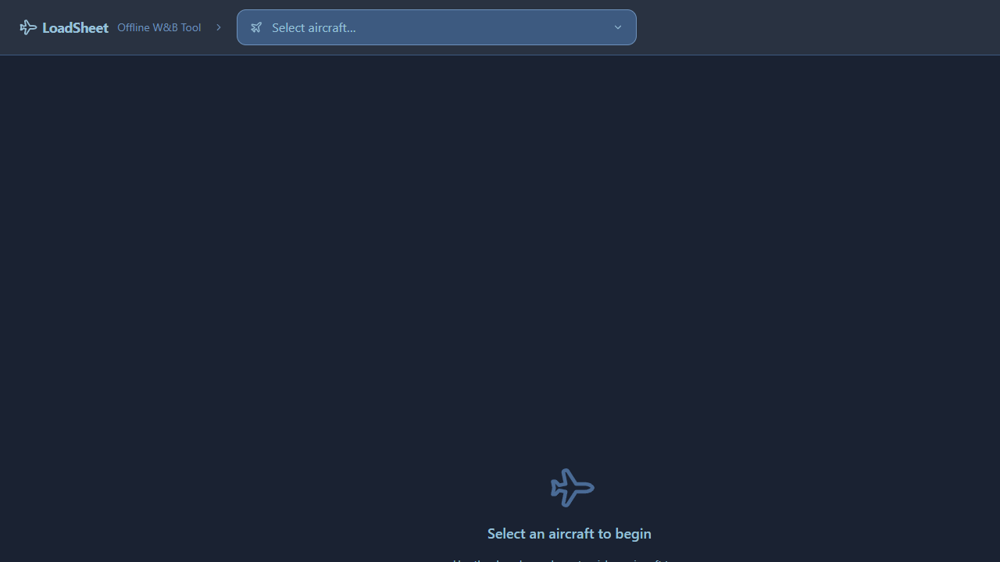
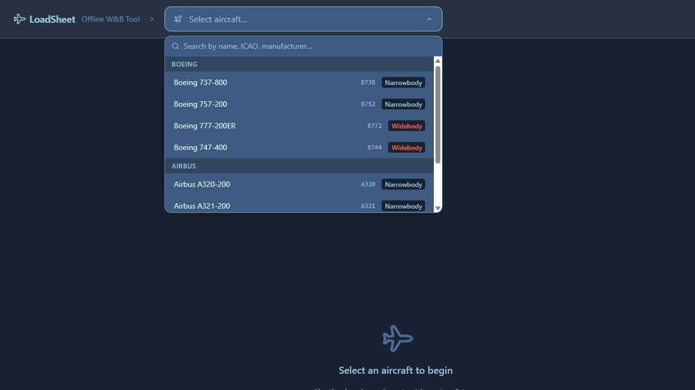
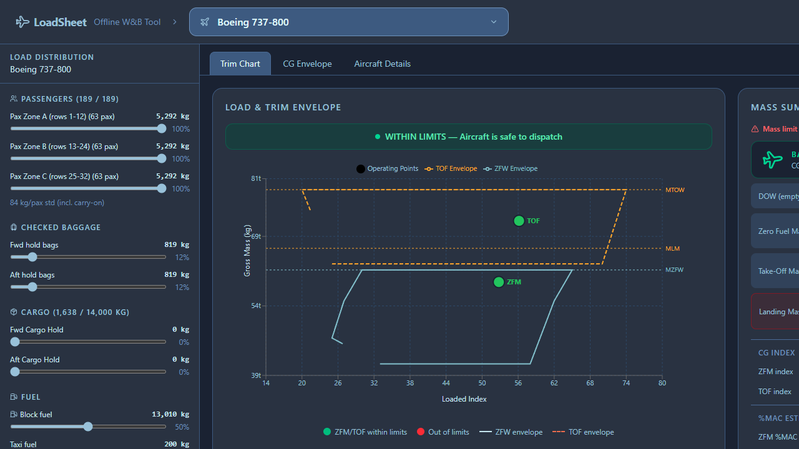
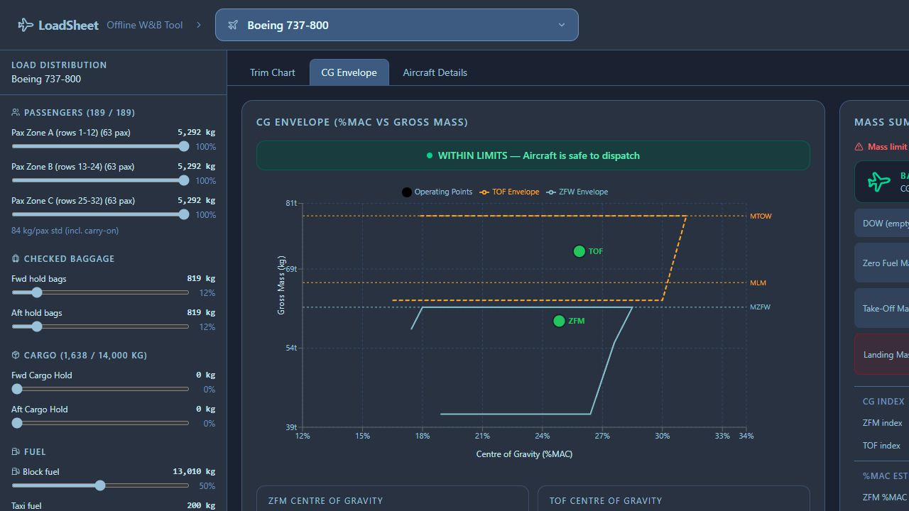
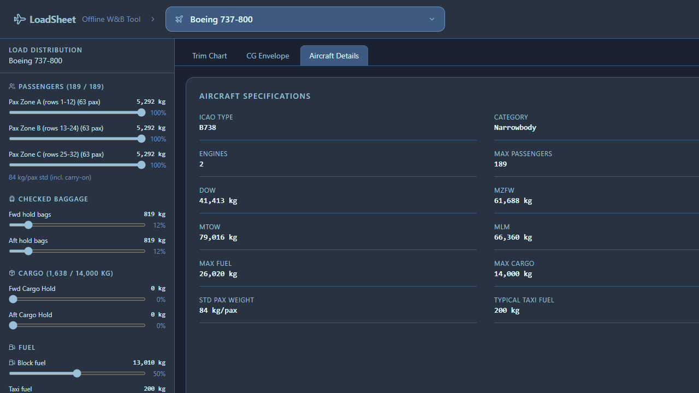
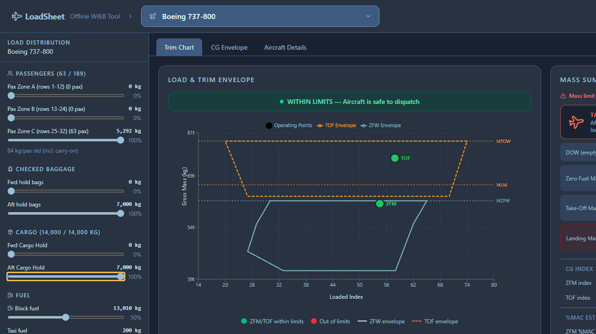

# Aircraft Loadsheet — Offline Weight & Balance Tool

An offline-capable, browser-based Weight & Balance (W&B) tool for commercial aircraft load planning. Built with **Vite + React + Tailwind CSS v4 + Recharts**.

---

## Screenshots

### Application Overview



### Aircraft Selector



### Live Trim Chart — Within Limits



### CG Envelope Detail



### Aircraft Details Tab



### Out-of-Limits — Tail-Heavy Configuration



---

## Features

### Aircraft Selection

- **Searchable dropdown** listing all aircraft types for which envelope data is available.
- Filter in real time by aircraft name, ICAO designator, manufacturer, or category (Narrowbody / Widebody / Regional jet).
- Aircraft are grouped by manufacturer in the dropdown.

### Load Distribution Panel (left sidebar)

Interactive sliders for every load station, updating the trim chart in real time:

| Station                    | Adjustable range                           |
| -------------------------- | ------------------------------------------ |
| Passengers — Forward zone  | 0 → zone capacity (steps of 1 pax weight)  |
| Passengers — Mid zone      | 0 → zone capacity                          |
| Passengers — Aft zone      | 0 → zone capacity                          |
| Checked baggage — Fwd hold | 0 → ½ max cargo (steps of 10 kg)           |
| Checked baggage — Aft hold | 0 → ½ max cargo (steps of 10 kg)           |
| Cargo — Fwd hold           | 0 → ½ max cargo (steps of 10 kg)           |
| Cargo — Aft hold           | 0 → ½ max cargo (steps of 10 kg)           |
| Block fuel (wing + centre) | 0 → max usable fuel (steps of 50 kg)       |
| Taxi fuel                  | 0 → 5 × typical taxi burn (steps of 10 kg) |
| Potable water              | 0 → 500 kg (steps of 10 kg)                |

Each slider shows live kg value, percentage of its maximum, and highlights in red if a limit is exceeded.

### Live Trim Chart

The main chart reproduces the **Load & Trim Envelope** (similar to the paper chart in AMM/FM documentation):

- **ZFW envelope** — closed polygon showing the safe CG range at Zero Fuel Weight, plotted as a solid blue line.
- **TOF envelope** — closed polygon showing the safe CG range at Take-Off mass, plotted as a dashed purple line.
- **Operating points** — two coloured dots plotted live:
  - **ZFM** (Zero Fuel Mass operating point) — green if inside ZFW envelope, red if outside.
  - **TOF** (Take-Off mass operating point) — green if inside TOF envelope, red if outside.
- **Reference lines** for MZFW, MTOW, and MLM labelled on the Y axis.
- **Status banner** above the chart: _WITHIN LIMITS_ (green) or _OUT OF LIMITS_ (red).

### Mass Summary Panel (right sidebar)

Displays computed masses alongside their certified limits:

| Field                      | Source                                     |
| -------------------------- | ------------------------------------------ |
| Dry Operating Weight (DOW) | Aircraft database constant                 |
| Zero Fuel Mass (ZFM)       | DOW + all payload + water                  |
| Take-Off Mass (TOM)        | ZFM + block fuel + taxi fuel               |
| Landing Mass (LM)          | Same as TOM (simplified — see assumptions) |
| ZFM Index                  | DOW index + payload station contributions  |
| TOF Index                  | ZFM index + fuel station contribution      |
| ZFM %MAC                   | Linear estimate from index                 |
| TOF %MAC                   | Linear estimate from index                 |

### Aircraft Details Tab

Tabular view of the selected aircraft's certified parameters: ICAO code, category, engine count, max passengers, DOW, MZFW, MTOW, MLM, max fuel, max cargo, standard passenger weight, and typical taxi fuel burn.

### Offline Operation

- No network requests at runtime. All aircraft data, envelopes, and business logic are bundled into the static build.
- Can be served from a local file system or a static web server with no backend.

---

## Supported Aircraft

| Aircraft         | ICAO | Category     | Max Pax | MTOW (kg) |
| ---------------- | ---- | ------------ | ------- | --------- |
| Boeing 737-800   | B738 | Narrowbody   | 189     | 79,016    |
| Boeing 757-200   | B752 | Narrowbody   | 239     | 115,680   |
| Boeing 777-200ER | B772 | Widebody     | 440     | 297,560   |
| Boeing 747-400   | B744 | Widebody     | 524     | 396,890   |
| Airbus A320-200  | A320 | Narrowbody   | 180     | 77,000    |
| Airbus A321-200  | A321 | Narrowbody   | 220     | 93,500    |
| Airbus A330-200  | A332 | Widebody     | 406     | 242,000   |
| Embraer E190     | E190 | Regional jet | 114     | 51,800    |

---

## Weight & Balance Assumptions

The following engineering and operational assumptions are embedded in the data and calculations. They are simplifications relative to the full aircraft Flight Manual (FM) computations and are intended for **planning and training purposes only**.

### Index System

- A single linear **arm-factor** is used per load station:
  ```
  index_delta = mass_kg × armFactor × 1000
  ```
  In the real FM, index contributions are derived from the exact moment arm of each seat row, ULD position, or fuel tank; this tool uses a representative mean arm for each zone.
- The **DOW Index** (aircraft empty CG index) is a fixed constant per aircraft type. In operation it varies per tail number (Basic Empty Weight and Arm from the Aircraft Weighing Report).
- All indices are dimensionless, scaled to a 0–100 range for display.

### Passenger Weight

- Standard weight: **84 kg per adult passenger**, including carry-on baggage (IATA standard mass — Summer, based on EASA CS-25 guidance for aircraft with >20 seats).
- No distinction between adult, child, or infant masses.
- No distinction between male and female standard masses.
- Passenger zones (A/B/C) are split equally by seat count (⌊maxPax / 3⌋ per zone). Real aircraft have non-uniform zone boundaries defined in the FM.

### Baggage

- Standard checked baggage weight: **13 kg per bag** (one bag per passenger assumed by default). This matches IATA standard bag allowance for short/medium-haul.
- Baggage CG is computed using the same arm factor as the cargo hold it occupies (fwd or aft).
- No ULD tare weight is modelled.

### Fuel

- A single mean arm factor covers all tanks (wing inner/outer cells, centre tank, auxiliary tank where applicable). In the real FM each tank has its own moment arm, and fuel CG shifts as tanks drain in sequence.
- **Density assumed at 0.785 kg/L** (Jet-A at +15 °C ISA). Max fuel capacity figures are in kg.
- Taxi fuel is loaded on top of block fuel. In practice, taxi fuel is burned prior to take-off and reduces TOW; this tool models both taxi fuel and block fuel as contributing to TOM (conservative).

### Landing Mass

- LM is equated to TOM in this tool. In reality, LM = TOM − trip fuel. Users should mentally subtract expected trip fuel when assessing landing mass against MLM.

### CG Envelope Vertices

- The ZFW and TOF envelopes are approximated as **simplified convex polygons** with 6–8 vertices each. Real aircraft envelopes may have more complex shapes (e.g. fuel arm curves, forward CG shift with flap extension).
- Envelope coordinates (index, mass) are derived from publicly available performance data, type certificate data sheets (TCDS), and operator documentation. They are representative but **not certified** for operational use.

### %MAC Calculation

- %MAC is estimated via a **linear mapping**: index 0 → 9 %MAC, index 100 → 39 %MAC. Real %MAC depends on the specific LEMAC (Leading Edge MAC) station and MAC length for each tail, and is not linearly related to the simplified index used here.

### Point-in-Polygon Test

- A **ray-casting algorithm** determines whether the ZFM and TOM operating points fall inside their respective envelopes. This is geometrically accurate for the simplified polygon shapes used.

---

## Getting Started

### Prerequisites

- Node.js 18+

### Install & Run

```bash
npm install
npm run dev
```

The app opens at `http://localhost:5173`.

### Build for Production / Offline Use

```bash
npm run build
```

Copy the `dist/` folder to any static web server or open `dist/index.html` directly.

---

## Tech Stack

| Library      | Version         | Purpose                  |
| ------------ | --------------- | ------------------------ |
| React        | 19              | UI framework             |
| Vite         | 8               | Build tool + dev server  |
| Tailwind CSS | 4 (Vite plugin) | Utility-first styling    |
| Recharts     | 2               | Composable chart library |
| Lucide React | latest          | Icon set                 |

---

## Disclaimer

> **This tool is for planning, training, and educational purposes only.**
> It must not be used for actual aircraft dispatch or operational weight & balance calculations.
> All certified W&B computations must be performed using the aircraft manufacturer's approved documentation (AFM/FM/Load & Trim Sheet) and, where required, operator-approved software.
